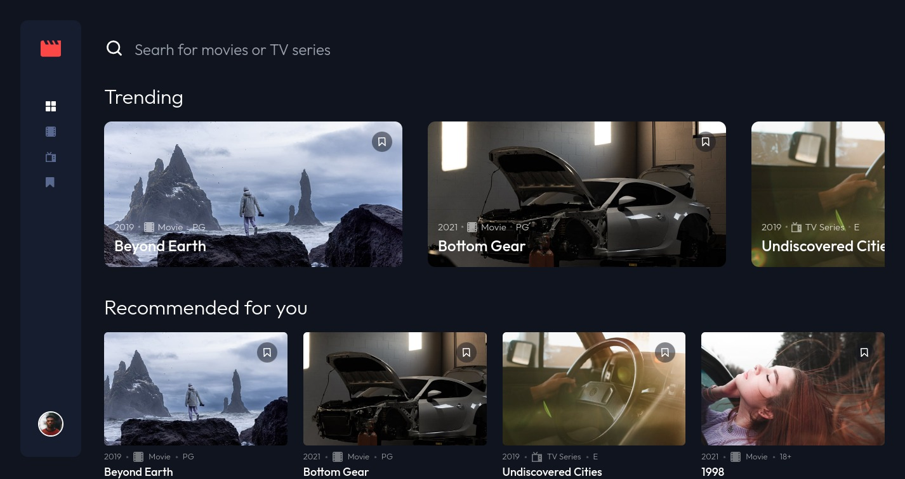

# Frontend Mentor - Entertainment Web App

### The challenge

Entertainment Web App

This multi-page entertainment web app will have you working with JSON data, routing, state management, and search functionality.

Users should be able to:

- Navigate between Home, Movies, TV Series, and Bookmarked Shows pages
- Add/Remove bookmarks from all movies and TV series
- Search for relevant shows on all pages
- View the optimal layout for the app depending on their device's screen size
- See hover states for all interactive elements on the page

### Screenshot

### Links

- Solution URL: [GitHub](https://github.com/manuelbenites/entertainment-web-app)
- Live Site URL: [Vercel](https://entertainment-web-hke5drdsn-manuelbs95.vercel.app/)

### Built with

- [React](https://reactjs.org/)
- [Vite](https://vitejs.dev/)
- [Tailwindcss](https://tailwindcss.com/)

## Author

- Website - [Manuel Benites](https://manuelbenites.vercel.app/)
- Frontend Mentor - [@ManuelBS95](https://www.frontendmentor.io/profile/ManuelBS95)
